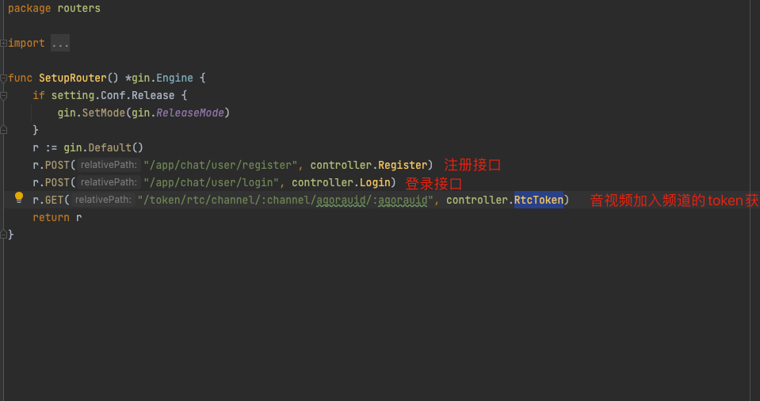

# appServer_go

## 1.创建一个数据库
### CREATE DATABASE app_server CHARACTER SET utf8mb4;
### 运行程序会根据model自动创建表
## 2.配置config.ini文件

### chat相关配置可以在console中找到

## 3.iOS工程需要一下改动

### 4.运行appserver 和 ios项目

## 说明

### 项目主要实现上面三个接口
### 该项目有详细注释 仅供参考